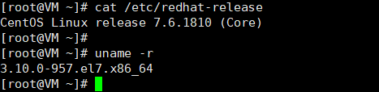

---
prev:
  text: '章节介绍'
  link: '/DevOps/docker/index'

next:
  text: '初始安装及基础命令'
  link: '/DevOps/docker/初始安装及基础命令'
---
## 是什么
解决了运行环境和配置问题的软件容器（直接将配置文件及环境等打包成ISO映像文件）

### 容器与虚拟机的区别
1. 容器体积小，只需最小内核，在操作系统层面实现虚拟化，并直接复用本地主机的操作系统。不像虚拟机是对系统的整体虚拟化。类似object.defineproperty 和 proxy的区别
2. 容器启动速度快，虚拟机则较慢
3. 容器复杂度简单，而虚拟机庞大冗余

###  优势
1. 更快的应用交付与部署速度
2. 更便捷的升级和扩缩容
3. 更简单的系统运维
4. 更高效的资源利用

## 前期环境准备
Linux系统内核版本在3.8以上，centos要在7及以上。使用uname -r 查看内核版本

### docker的基本组成（三件套）

::: tip 镜像
类似于java中的类模版。是一个只读的模版，用来创建Docker容器，一个镜像可以创建很多个容器
:::

::: tip 容器
由镜像new出来的各个实例对象。可以将容器看做简易版的Linux环境
:::

::: tip 仓库
存放镜像的地方
:::

