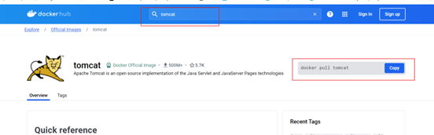

---
prev:
  text: '容器数据卷'
  link: '/DevOps/docker/容器数据卷'

next:
  text: 'Docker常规软件的安装'
  link: '/DevOps/docker/Docker常规软件的安装'
---

# Docker常规软件的安装

> 在docker hub上或者是直接docker search 进行镜像的搜索



## 常规步骤
1.	搜索镜像
2.	拉取镜像
3.	查看镜像
4.	启动镜像
5.	停止容器
6.	移除容器


## 实例：Tomcat安装
```bash
1.	docker search tomcat
2.	docker  pull tomcat
3.	docker images tomcat
4.	docker run -d -p 8080:8080 tomcat
5.	docker stop 容器ID
6.	docker rm -f  容器ID
```
如果Tomcat是404无法访问，将/usr/local/tomcat目录下的webapps文件删除，将webapps.list文件重命名为webapps即可。或者在防火墙中将对应端口打开


### 下载无修改版 ： 
1. docker pull billygoo/tomcat8-idk8
2. docker run -d -p 8080:8080 --name mytomcat8 billygoo/tomcat8-jdk8

## 实例MySQL安装
```bash
1.	docker pull mysql:5.7 下载指定版本的MySQL
2.	docker run -p 3306:3306 -e MYSQL_ROOT_PASSWORD=123456 -d mysql:5.7运行MySQL服务
```

