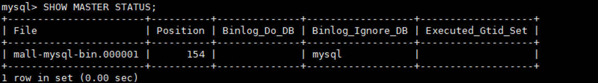
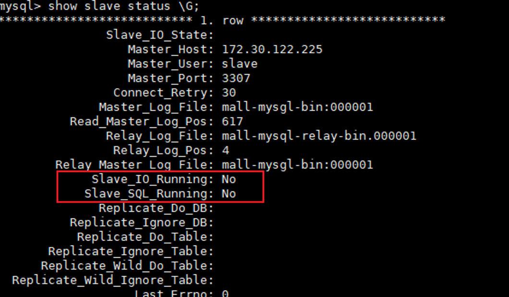
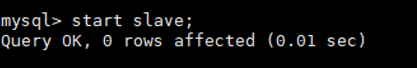
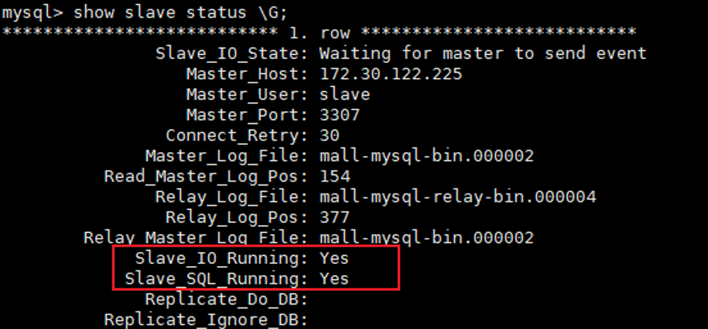
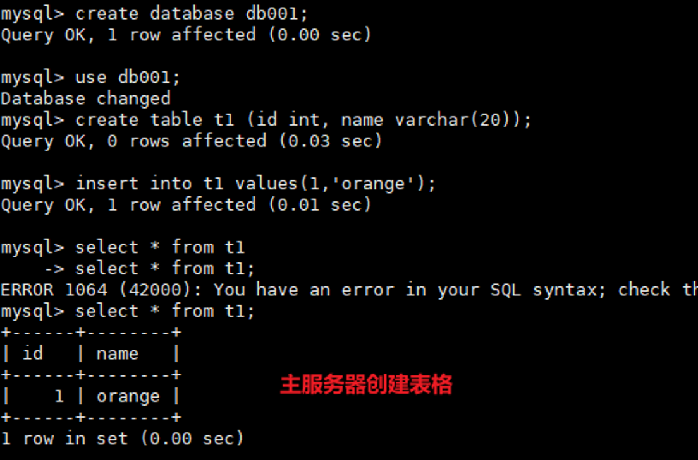
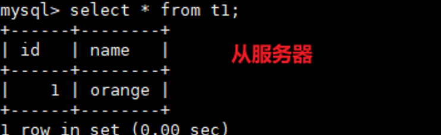

---
prev:
  text: 'Docker常规软件的安装'
  link: '/DevOps/docker/Docker常规软件的安装'
  
next:
  text: '三主三从redis集群扩缩容配置'
  link: '/DevOps/docker/基础命令2'
---

# 预期效果
主服务器3307修改的数据在从服务器3308中能进行同步

## 具体实施步骤

### 1. 新建主服务器3307
```bash
docker run -p 3307:3306 --name mysql-master -v
/mydata/mysql-master/log:/varlog/mysql -v
/mydata/mysql-master/data:/var/lib/mysql  -v
/mydata/mysql-master/conf.d:/etc/mysql -e MYSQL_ROOT_PASSWORD=root -d mysql:5.7
```

### 2. 进入`/mydata/mysql-master/conf.d`目录下新建`my.cnf`文件
```bash
[mysqld]
##设置server id，同一局域网中需要唯一
server_id=101
##指定不需要同步的数据库名称
binlog-ignore-db=mysql
##开启二进制日志功能
log-bin=mall-mysql-bin
##设置二进制日志使用内存大小(事务)
binlog_cache_size=1M
##设置使用的二进制日志格式(mixed,statement，row)
binlog_format=mixed
##二进制日志过期清理时间。默认值为0，表示不自动清理
expire_logs_days=7
##跳过主从复制中遇到的所有错误或指定类型的错误，避免slave端复制中断
## 如:1062错误是指一些主键重复，1032错误是因为主从数据库数据不一致
slave_skip_errors=1062
```

### 3. 修改完之后重启master实例：`docker restart mysql-master`

### 4. 进入mysql-master容器
```bash
docker exec -it mysql-master /bin/bash
mysql -uroot -p 之后输入密码root即可进入数据库
```

### 5. master容器内创建数据同步用户
```bash
CREATE USER 'slave'@'%' IDENTIFIED BY '123456'; #创建slave用户以123456的密码登录并授权给其相关的操作权限 
#或使用create user 'slave'@'%' identified by '123456';
GRANT REPLICATION SLAVE, REPLICATION CLIENT ON *.* TO 'slave'@'%';
#或使用grant replication slave, replication client on *.* to 'slave'@'%';
```

### 6.	新建从服务器3308

```bash
docker run -p 3308:3306 --name mysql-slave -v 
/mydata/mysql-slave/log:/varlog/mysql -v
/mydata/mysql-slave/data:/var/lib/mysql -v 
/mydata/mysql-slave/conf.d:/etc/mysql -e MYSQL_ROOT_PASSWORD=root -d mysql:5.7
```

### 7. 进入`/mydata/mysql-slave/conf.d`目录下新建`my.cnf`
```bash
[mysqld]
##设置server id，同一局域网中需要唯一
server_id=102
##指定不需要同步的数据库名称
binlog-ignore-db=mysql
##开启二进制日志功能
log-bin=mall-mysql-bin
##设置二进制日志使用内存大小(事务)
binlog_cache_size=1M
##设置使用的二进制日志格式(mixed,statement，row)
binlog_format=mixed
##二进制日志过期清理时间。默认值为0，表示不自动清理
expire_logs_days=7
##跳过主从复制中遇到的所有错误或指定类型的错误，避免slave端复制中断
## 如:1062错误是指一些主键重复，1032错误是因为主从数据库数据不一致
slave_skip_errors=1062
## relay_log配置中继日志
relay_log=mall-mysql-relay-bin
## log_slave_updates表示slave将复制事件写进自己的二进制日志
log_slave_updates=1
## slave设置为只读(具有super权限的用户除外)
read_only=1
```

### 8.	修改完之后重启slave实例：`docker restart mysql-slave`
### 9.	在主数据库中查看主动同步状态：`SHOW MASTER STATUS;`

### 10.	进入mysql-slave容器
```bash
docker exec -it mysql-slave /bin/bash
mysql -uroot -p #输入密码后登录
```
### 11.	在从数据库中配置主从复制
```bash
change master to master_host='主服务器IP', master_user='slave', master_password='主服务器密码',
master_port=3307, master_log_file='mall-mysgl-bin:000001', master_log_pos=154, master_connect_retry=30;
```
```bash
• master_log_pos字段通过 SHOW MASTER STATUS; 查看
• master_host:主数据库的iP地址;
• master_port:主数据库的运行端口;
• master_user:在主数据库创建的用于同步数据的用户账号;
• master_password:在主数据库创建的用于同步数据的用户密码
• master_log_file:指定从数据库要复制数据的日志文件,通过査看主数据的状态，获取File参数;
• master_log_pos:指定从数据库从哪个位置开始复制数据，通过査看主数据的状态，获取Position参数
• master_connect_retry:连接失败重试的时间间隔，单位为秒。
```

### 12.	在从数据库中查看主从同步状态：`show slave status \G`;可以看到红框中的内容提示还没有开始备份

### 13.	在从数据库中开启主从同步：`start slave`;

### 14.	查看从数据库状态发现已经同步。当出现IO为No的时候，执行：`stop slave —— reset slave——start slave`即可，<br/>
当出现红框中的选项都是yes时就证明主从配置完成


### 15.	主从复制测试
    - 主机新建库-使用库-新建表-插入数据
    - 从机使用库-查看记录
   

