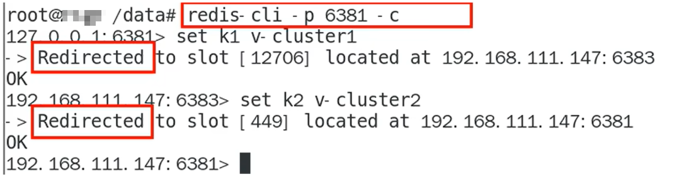
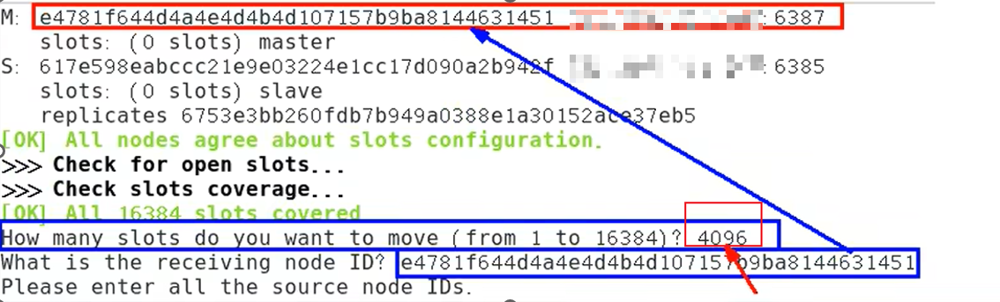

# 三主三从redis集群扩缩容配置

## 前置准备
### 创建6台服务器
```bash
docker run -d --name redis-node-1 --net host -primleged=true -v /data/redis/share/redis-node-1:/data redis:6.0.8 --cluster-enabled yes --appendonly yes --port 6381 
docker run -d --name redis-node-2 --net host -primleged=true -v /data/redis/share/redis-node-2:/data redis:6.0.8 --cluster-enabled yes --appendonly yes --port 6382 
docker run -d --name redis-node-3 --net host -primleged=true -v /data/redis/share/redis-node-3:/data redis:6.0.8 --cluster-enabled yes --appendonly yes --port 6383
docker run -d --name redis-node-4 --net host -primleged=true -v /data/redis/share/redis-node-4:/data redis:6.0.8 --cluster-enabled yes --appendonly yes --port 6384
docker run -d --name redis-node-5 --net host -primleged=true -v /data/redis/share/redis-node-5:/data redis:6.0.8 --cluster-enabled yes --appendonly yes --port 6385 
docker run -d --name redis-node-6 --net host -primleged=true -v /data/redis/share/redis-node-6:/data redis:6.0.8 --cluster-enabled yes --appendonly yes --port 6386
```

## 具体步骤
### 1. 进入redis-node-1为6台机器构建集群关系
这里宿主机IP以127.0.0.1举例，`--cluster-replicas`代表为每一个master创建一个slave节点
```bash
Docker exec -it redis-node-1 /bin/bash
Redis-cli --cluster create  127.0.0.1:6381 127.0.0.1:6382 127.0.0.1:6383 127.0.0.1:6384 127.0.0.1:6385 127.0.0.1:6386 --cluster-replicas
```

### 2.	进入6381，查看集群状态
```bash
redis -cli -p 6381
cluster info 
cluster nodes
```

## 主从容错切换迁移
### 1.	启动6381并进入(这里使用集群模式进入：`redis-cli -p 6381 -c`)
### 2.	新增两个key后可以看到相对于单机模式不会再报错

### 3.	查看集群信息： redis-cli --cluster check 127.0.0.1:6381


## 主从扩容
### 1.	新增6387、6388两个节点，新增后启动查看是否是8个节点
```bash
docker run -d --name redis-node-7 --net host -primleged=true -v /data/redis/share/redis-node-7:/data redis:6.0.8 --cluster-enabled yes --appendonly yes --port 6387 
docker run -d --name redis-node-8 --net host -primleged=true -v /data/redis/share/redis-node-8:/data redis:6.0.8 --cluster-enabled yes --appendonly yes --port 6388
```
### 2.	进入6387中（docker exec -it redis-node-7 /bin/bash)
### 3.	将新增的6387节点作为master节点加入到原先的集群中
```bash
redis-cli --cluster add-node
 127.0.0.1:6387  # [!code error]
 127.0.0.1:6381 #  [!code warning]
红色行为第7台需要加入集群的主机
黄色行为之前的1号机，通过1号机加入集群
```
### 4.	检查集群的状态（`redis-cli --cluster check 127.0.0.1:6381`）
### 5.	重新分配槽号 （`redis-cli --cluster reshard 127.0.0.1:6381`）。
对1号机为基础的集群重新分配槽号，之后根据master台数对16384个槽位进行均分。在图中位置输入4096（16384/4），同时指定给6387的node ID分配槽位，之后按照提示输入`all` 和 `yes`即可



我们可以看出新加入的7号机的4096个槽位是之前3个master主机每个均分给他一点组成的
### 6.	为7号机分配从节点6388
```bash
redis-cli --cluster add-node ip:新slave端口 ip:新master端口 --cluster-slave --cluster-master-id 新主机节点ID

例如：
redis-cli --cluster add-node ip:127.0.0.1:6388 ip:127.0.0.1:6387 --cluster-slave --cluster-master-id 35291fb3a2693f250d7ba16ff4e94cbe43752731
```

## 主从缩容
### 1.	获得节点6388的节点ID（`redis-cli --cluster check 127.0.0.1:6388`）
### 2.	将6388从集群中删除（`redis-cli --cluster del-node ip:从机端口 从机6388节点ID`）
### 3.	将6387的槽号清空重新分配（`redis-cli --cluster reshard 127.0.0.1:6381`）。
是以1号机作为基点对整个集群进行槽号的重新分配，然后整体分配给6381，不使用平均分配了

### 4.	将空槽位的6387删除（`redis-cli --cluster del-node ip:6387端口 6387节点ID`）
### 5.	最后检查6381为首的集群状态（`redis-cli --cluster check 127.0.0.1:6381`）
