---
prev:
  text: 'Docker初印象'
  link: '/DevOps/docker/Docker初印象'

next:
  text: '基础命令2'
  link: '/DevOps/docker/基础命令2'
---


## 安装docker
可以参考官方安装文档

::: tip 官方网址
https://docs.docker.com/engine/install/centos/
:::

1. 安装gcc等编译工具(一般的云服务器是默认已经安装了的)：
``` bash
yum -y install gcc ; 
yum -y install gcc c++。
```

2. 安装docker的远程仓库：
``` bash
yum install -y yum-utils;
yum-config-manager --add-repo http://mirrors.aliyun.com/docker-ce/linux/centos/docker-ce.repo。这里的第二条命令要使用国内的镜像，如果使用官方的命令的话很可能会超时。下图是安装成功后的样子
```
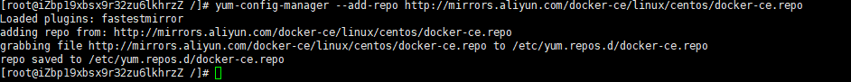

3. 更新yum软件包的索引：
```bash
yum makecache fast
```

4. 安装docker引擎（遇到需要确认的地方都按y即可）：
```bash
yum install docker-ce docker-ce-cli containerd.io docker-buildx-plugin docker-compose-plugin
```
5. 启动docker：
```bash
systemctl start docker

docker run hello-world  #测试docker有没有安装好
``` 
安装成功后的信息：
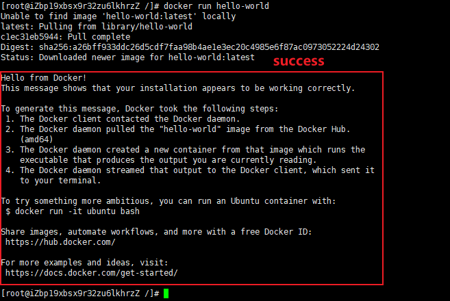

## 设置阿里云镜像加速
1. 在容器镜像服务模块获取加速器地址
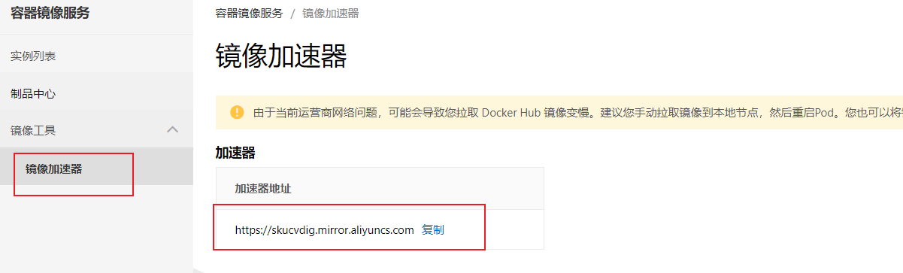
2. 按照页面中的操作文档进行操作即可，记得选择centos对应的文档

## docker基础命令
### 帮助启动类
- 启动docker:`systemctl start docker`
- 停止docker: `systemctl stop docker`
- 重启docker:`systemctl restart docker`
- 查看docker状态:`systemctl status docker`
- 开机启动:`systemctl enable docker`
- 查看docker概要信息:`docker info`
- 查看docker总体帮助文档:`docker --help`
- 查看docker命令帮助文档:`docker 具体命令 --help`

### 镜像命令
- `docker images` <br>
  列出机器中的所有镜像。`docker images -q` 意味只列出当前所有镜像的ID
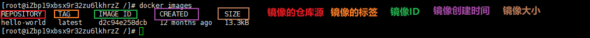
- `docker search`  [选项] 镜像名称 <br>
  查询镜像的名称。<br>
  选项：-- limit (只列出n个镜像，默认显示25个。例如`docker search --limit 5 redis`，意思为搜索Redis镜像，只罗列出5个搜索结果)

 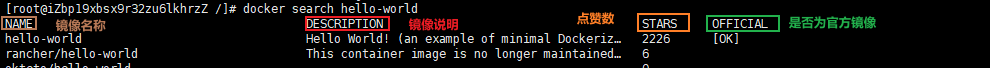

 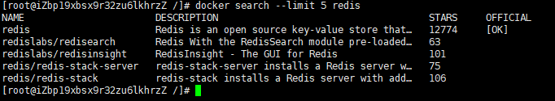

- `docker pull` 镜像名字
  用来下载相应的镜像。有两种写法：
  - `docker pull 镜像名 :TAG`: 指定镜像版本，TAG为版本号，例如`docker pull mysql :5.6`(即下载5.6版本的mysql镜像)
  - `docker pull 镜像名`：这种不写tag的方式默认就是下载镜像的最新版本，其等价于`docker pull 镜像名:latest`
- `docker system df` ：查看镜像/容器/数据卷所占的空间
- `docker rmi 镜像名或者镜像ID`。使用`docker  rmi -f 镜像名或者镜像ID` 可强制删除。类似Linux中的rm -rf。<br>
  想删除多个镜像时，使用`docker rmi 镜像名1:TAG 镜像名2:TAG` 或者按照ID进行删除`docker rmi image_id1 image_id2 image_id3`<br>
  想删除全部的镜像时使用 `docker rmi $(docker images -qa)`

### 虚悬镜像
仓库名和标签都为none的镜像俗称虚悬镜像
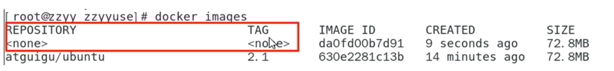


### 容器命令
- 新建并启动容器： docker run [选项] IMAGE [指令] [其他参数]
```bash{4,5}
选项：
--name="容器新名字"为容器指定一个名称;
-d:后台运行容器并返回容器ID，也即启动守护式容器(后台运行);
-i:以交互模式运行容器，通常与 -t 同时使用:
-t:为容器重新分配一个伪输入终端，通常与-i同时使用,即启动交互式容器(前台有伪终端，等待交互)效果见下图
-P ip:hostPost:containerPort:随机端口映射，注意是大写P。
-p hostPost:containerPort:指定端口映射，注意是小写p
```
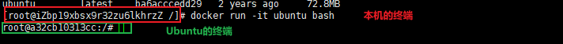
- 列出所有正在运行的容器： docker ps [选项]
```bash
选项：
-a:列出当前所有正在运行的容器+历史上运行过的
-l:显示最近创建的容器。
-n:显示最近n个创建的容器。
-q:静默模式，只显示容器编号。
```
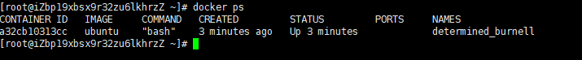

- 退出容器
  -  exit 退出，容器停止。可以看到使用 `docker ps` 查看现有的容器时为空
     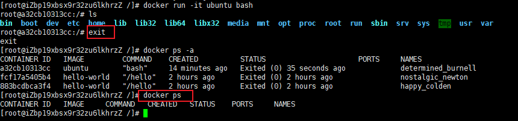
  - Ctrl + p + q退出，容器不停止
- 启动已经停止的容器： `docker start 容器ID或者容器名称`
- 重启容器： `docker restart 容器ID或者容器名称`
- 停止容器： `docker stop 容器ID或者容器名称`
- 强制停止容器： `docker kill 容器ID或者容器名称`
- 删除已停止的容器：`docker rm 容器ID`。`docker rm -f 容器ID` 为强制删除容器，不给缓冲区
  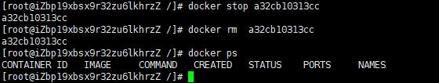
  - 一次性删除多个容器：`docker rm -f $(docker ps -aq)` 或者`docker ps -aq | xargs docker rm`


