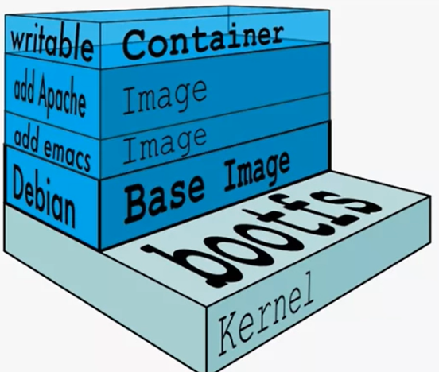
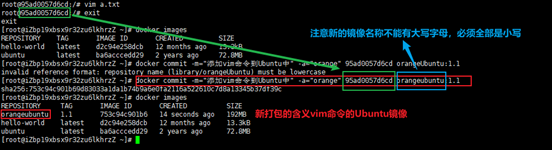
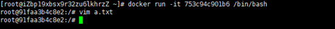
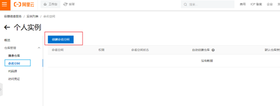
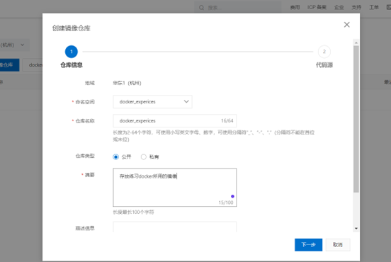
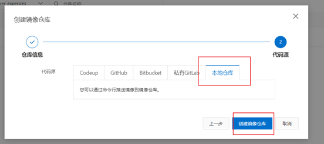
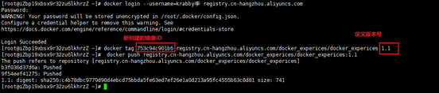

---
prev:
  text: '初始安装及基础命令'
  link: '/DevOps/docker/初始安装及基础命令'

next:
  text: '容器数据卷'
  link: '/DevOps/docker/容器数据卷'
---

# 容器命令
- 启动守护式容器（后台服务） 
在大部分场景下，我们都希望docker是在后台运行的，可以通过-d 指定容器的后台运行模式。但要确保运行的程序是以前台进程的形式运行，否则程序会自动关闭，因为没有程序会使用到它
    - 前台交互式启动（`docker run -it mysql`）
    - 后台守护式启动（`docker run -d mysql`）
- 查看容器日志：`docker logs [容器id]`
- 查看容器内运行的进程：`docker top [容器id]`
- 查看容器内部细节：`docker inspect [容器id]`
- 进入正在运行的容器并以命令行交互
    - `docker exec -it [容器id] bashShell`。用exec是在容器中打开新的终端，并启动新进程， 之后再用exit退出时不会导致容器的停止。一般使用该命令   
    - `docker attach [容器id]`。用attach是直接进入容器启动命令的终端，不会启动新进程，之后再用exit退出时会导致容器的停止
- 从容器中拷贝文件到主机中：`docker cp [容器ID:容器内路径 目的主机路径]` 
例如：docker cp f5fa5789347c2:/usr/local/mysql/container.txt  /tmp/c.txt

- 导入和导出容器
  - 导入：从tar包中的内容创建一个新文件系统再导入为镜像。格式如下： `cat 文件名.tar | docker import -镜像用户/镜像名:镜像版本号` （例如：cat abcd.tar | docker import -user1/firefox:3.8）这里的镜像用户，镜像名和镜像版本号都是自定义的。
  - 导出：导出的内容作为一个tar包归档文件。格式如下： `docker export [容器id] > [文件名.tar]` （例如docker export f5fa5789347c2 > abcd.tar）

## docker镜像
### 底层原理：联合文件系统
其支持对文件系统的修改作为一次提交来一层层的叠加，是docker镜像的基础，就像乐高积木一样。镜像可以通过分层来进行继承
### docker加载原理
由一层层的文件系统组成，在docker的最底层是引导文件系统bootfs.仅下载最核心的一部分，还有rootfs. 
之所以采取分层结构是因为要共享资源，方便复制迁移，类似与封装组件的思想，镜像的每一层都可以被共享。 
镜像层是只读的，容器层是可写的。当容器启动时，新的可写层会加载到镜像层的顶部，这一层通常被称为容器层，容器层之下的都叫镜像层

## docker镜像commit操作
使用docker commit 提交容器副本使之成为一个新的镜像，命令格式如下： 
`docker commit -m='描述信息' -a='作者' [容器ID] 要创建的新镜像的名称:[标签名]`
### 案例操作
目前下载的Ubuntu镜像运行后是没有vim命令的，我们安装vim并将其打包成新的镜像:
1.	执行apt-get update 命令 与 apt-get -y install vim 命令将vim安装到Ubuntu上
2.	执行commit操作实现自定义镜像的提交

让我们运行一下新建的orange镜像，看看里面能不能运行vim命令

可以看到运行vim命令是没有问题的~

## 本地镜像发布到阿里云
1.	在阿里云控制台中找到容器与镜像服务
2.	选择创建个人版实例
3.	创建命名空间

4. 创建镜像仓库

5. 将镜像推送到Registry，执行操作指南中的第三步
最终的推送成功页面：

