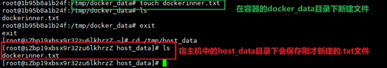
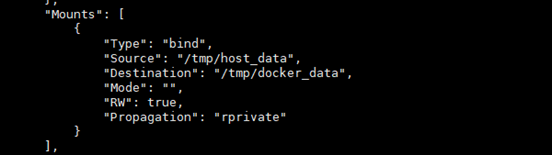

---
prev:
  text: '基础命令2'
  link: '/DevOps/docker/基础命令2'

next:
  text: 'Docker常规软件的安装'
  link: '/DevOps/docker/Docker常规软件的安装'
---

# 容器数据卷


::: tip 前置提示
如果在挂载时出现permission denied 的话在挂载目录后加--privileged=true即可
::: 

## 数据卷的作用
将容器中的文件备份+持久化到宿主机目录。是对docker容器的持久化备份以防止容器文件的丢失

## 运行带有数据卷的实例
```bash
docker run  -it --privileged=true-v /宿主机绝对目录:/容器内目录  [镜像名]
```


将容器中docker_data目录中的文件映射备份到宿主机中的/tmp/host_data目录下。如果宿主机没有该目录会自动创建一个


> 特点
1. 数据卷可在容器之间共享或重用数据。
2. 卷中的更改可以直接实时生效
3. 数据卷中的更改不会包含在镜像的更新中
4. 数据卷的生命周期一直持续到没有容器使用它为止

### 查看数据卷是否挂载成功
```bash
docker inspect [容器ID]
```


可以在mounts部分看到已经挂载成功。 <span style="color:red">即使在容器停止后，宿主机上的更改也是会同步到容器中的</span>

::: details 详细规则 
- 默认规则下可以对数据卷进行读写操作(rw)<br>
```bash
docker run -it --privileged=true -v /宿主机绝对路径目录:/容器内目录:rw [镜像名]
```

- 读写分离规则下，对数据卷只可读，不可写(ro)。这种情况下容器想写文件同步到宿主机是不行的<br>
```bash
docker run -it --privileged=true-v/宿主机绝对路径目录:/容器内目录:ro [镜像名]
```
:::
## 卷的继承与共享
```bash
docker run -it --privileged=true --volumes-from 父类 --name u2 ubuntu
```
上述命令的解释
```text
-i ：表示以交互模式运行容器，保持标准输入（STDIN）打开。

-t：为容器分配一个伪终端，通常用于交互式操作。

--privileged=true：使容器获得更高的权限。使用该选项后，容器将能够访问主机的所有设备，并且可以执行一些通常被限制的操作（例如，加载内核模块）。通常用于需要访问硬件或进行系统级操作的容器。

--volumes-from 父类：该选项允许新容器共享父容器（这里举例为父类）的卷。这意味着新容器将能够访问父容器中挂载的所有数据卷。这也是实现卷共享的核心。

--name u2：为新创建的容器指定一个名称（这里为u2）。这样，就可以通过u2这个名称来引用和管理容器，而不需要使用自动生成的容器ID。

ubuntu：这是要使用的基础镜像的名称。这里以Ubuntu镜像为例。
```

::: warning 注意
父容器关闭不影响子容器继承的内容，即父子容器之间是独立的。父容器重新启动后还是有子容器更改的文件
:::


